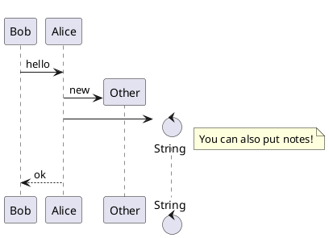

# nicesima(偽島, ニセシマ)

[](https://gohugo.io)
[](LICENSE)


> A blog theme for [Hugo](https://gohugo.io) and apply for [icyleaf' s blog](https://icyleaf.com) (but also a preview site).

## Features

- Images lazy loading ([Can I use?](https://caniuse.com/#search=Lazy%20loading%20via%20attribute%20for%20images%20%26%20iframes))
- Automatically highlighting code (Support by [highlight.js](https://highlightjs.org/))
- TeX Functions (Support by [KaTeX](https://katex.org/))
- [PlantUML](https://plantuml.com/en/) (Sequence diagram, Usecase diagram, Class diagram ...)
- Dark/Light Mode
- Support for embedded BiliBili video
- Support hidden text
- Language packs for `en` and `zh`

Here is a table showing the similarities and differences between [nicesima](https://github.com/niceRAM/nicesima) and [mogege](https://github.com/Mogeko/mogege) and [LeaveIt](https://github.com/liuzc/LeaveIt):

| Features                        | *nicesima*   | [mogege(81e57f)](https://github.com/Mogeko/mogege/commit/7c7e26d0b04fb04a0d5c69d837c26823d881e57f) | LeaveIt |
| ------------------------------- | ------------ | ------------------------------------------------------------ | ------- |
| Categories                      | Optimization | Yes                                                          | Yes     |
| Tags                            | inherit      | Yes                                                          | Yes     |
| RSS support                     | inherit      | Yes                                                          | Yes     |
| sitemap.xml                     | inherit      | Yes                                                          | Yes     |
| robots.txt                      | inherit      | Yes                                                          | Yes     |
| Quote                           | inherit      | Optimization                                                 | Yes     |
| Images lazy loading             | inherit      | Optimization[*](https://caniuse.com/#search=Lazy%20loading%20via%20attribute%20for%20images%20%26%20iframes) | Yes     |
| Dark/Light Mode                 | inherit      | Optimization                                                 | Yes     |
| Highlighting code               | Optimization | Optimization                                                 | Yes     |
| Comment area                    | Optimization | Optimization                                                 | Yes     |
| TeX Functions                   | inherit      | Yes                                                          |         |
| PlantUML                        | inherit      | Yes                                                          |         |
| BiliBili video (shortcodes)     | inherit      | Yes                                                          |         |
| Updated (shortcodes)            | inherit      | Yes                                                          |         |
| Hidden text (shortcodes)        | Optimization | Yes                                                          |         |
| Easy-searched text (shortcodes) | Yes          |                                                              |         |
| Social button                   |              | Yes                                                          | Yes     |
| TOC                             | Yes          |                                                              |         |
| lightGallery                    |              |                                                              | Yes     |

## Requirements

Hugo-extended 0.80.0 or higher

**Hugo extended version**, read more [here](https://gohugo.io/news/0.48-relnotes/)

## Installation

Navigate to your hugo project root and run:

```bash
git submodule add https://github.com/icyleaf/nicesima themes/nicesima
```

Then run hugo (or set `theme: nicesima` in configuration file)

```bash
hugo server --minify --theme nicesima
```

## Creating site from scratch

Below is example how to create new site from scratch

```bash
hugo new site mydocs; cd mydocs
git init
git submodule add https://github.com/icyleaf/nicesima  themes/nicesima
cp -R themes/nicesima/exampleSite/content .
```

```bash
hugo server --minify --theme nicesima
```

## Lazy loading

If your browser is [supported](https://caniuse.com/#search=Lazy%20loading%20via%20attribute%20for%20images%20%26%20iframes),
we will lazy loading `` and `<iframes>`

Make sure your browser version:

- Chrome > 76
- Firefox > 75

## TeX Functions

**Note:** [list of TeX functions supported by KaTeX](https://katex.org/docs/supported.html)

To enable KaTex globally set the parameter `math` to `true` in a project's `config.toml`

To enable KaTex on a per page basis include the parameter `math: true` in content files.

### Example

```latex
% Inline math:
$$ \varphi = \dfrac{1+\sqrt5}{2}= 1.6180339887… $$

% or
% Block math:
$$
 \varphi = 1+\frac{1} {1+\frac{1} {1+\frac{1} {1+\cdots} } }
$$
```


## PlantUML

**PlantUML is supported by the [official server](http://www.plantuml.com/plantuml/uml/SyfFKj2rKt3CoKnELR1Io4ZDoSa70000)**

To enable KaTex globally set the parameter `plantuml` to `true` in a project's `config.toml`

To enable KaTex on a per page basis include the parameter `plantuml: true` in content files.

You can insert PlantUML in the post by:

<pre>
&#96;&#96;&#96;plantuml
PlantUML syntax
&#96;&#96;&#96;
</pre>

For example:




## Embedded BiliBili video

You can embed BiliBili videos via Shortcodes, just provide the AV 号/BV 号 of the bilibili video

You can also use the PV 号 to control the 分 P (default: `1`)

```txt

```

Click [here](https://mogeko.github.io/2020/079#biliplayer) for examples

## Hidden text

You can use "hidden text" to hide spoiler content

```txt
 HIDDEN TEXT 
```

Click [here](https://mogeko.github.io/2020/080#spoiler) for examples

## Easy-searched text

You can use "Easy-searched text" to set as a link for proper nouns that only need to search to find relevant explanations. For readers, just click on the links to search easily.

```txt

```

You can also use the `search-engine` to choose which engine to use.

```txt

```

By default, `Google` will be used. You can change it to others by the following.

```txt
# Use "Bing"


# Use "GitHub"

or


# Use "Bilibili"

or


# Use "Baidu"

or

```

And you can set any of the above search engines as the default in `config.toml` by the following:

```toml
[params]
  easySearchedEngine = "github"
```

## TOC

The TOC can be enabled by the following config.

```toml
[params]
  toc = true
```

And you can fold inactive TOC automatically:

```toml
[params]
autoCollapseToc = true
```

## Utteranc comment system

This blog supports the [utteranc](https://utteranc.es) comment system.

It is lighter and more powerful than Giscus.

To use utteranc, you need make sure the [utterances app](https://github.com/apps/utterances) is installed on the repo, otherwise users will not be able to post comments.

Then enable utteranc in config.toml

```toml
[params]
  enableComment = "utteranc"
```

Then Configuration: (For more settings, please refer to
[HomePage](https://utteranc.es))

```toml
[params.utteranc] # Homepage: https://utteranc.es
  repo = "icyleaf/icyleaf.com" # The repo to store comments
  issueTerm = "title" # the mapping between blog posts and GitHub issues.
  theme = "preferred-color-scheme" # Theme
  crossOrigin = "anonymous" # default: anonymous
  label = "✨💬✨"
  async = true
```

## Giscus comment system

This blog supports the [giscus](https://giscus.app) comment
system.

Then enable giscus in config.toml

```toml
[params]
  enableComment = "giscus"
```

```toml
[params.giscus] # Github: https://github.com/gitalk/gitalk
  repo = "icyleaf/icyleaf.com"
  repoId = ""
  categoryId = ""
  localPreview: true
```

## Custom CSS/JavaScript

Support custom CSS or JavaScript

Place your custom CSS and JavaScript files in the `/static/css` and `/static/js`
directories of your blog, respectively

```txt
static
├── css
│   └── _custom.css
└── js
    └── _custom.js
```

Then edit in `config.toml`:

```toml
[params.custom]
  css = ["css/_custom.css"]
  js = ["js/_custom.js"]
```

> Currently only supports CSS does not support Sass

## Configuration

There are few configuration options you can add to your `config.toml` file.

```toml
baseURL = ""                  # <head> 里面的 baseurl 信息，填你的博客地址
title = ""                    # 浏览器的标题
defaultContentLanguage: zh-cn # 文字语言
languageCode = "zh-cn"        # HTML 标记语音
hasCJKLanguage = true         # 开启可以让「字数统计」统计汉字
theme = "nicesima"            # 主题

paginate = 15                 # 每页的文章数
enableEmoji = true            # 支持 Emoji
enableRobotsTXT = true        # 支持 robots.txt

# Chroma 代码高亮 http://gohugo.io/content-management/syntax-highlighting/
pygmentsUseClasses=true # 使用自定义的代码高亮样式
[markup]
  [markup.highlight]
    codeFences = true
    anchorLineNos = false
    guessSyntax = false
    hl_Lines = ""
    lineAnchors = ""
    lineNoStart = 1
    lineNos = true
    lineNumbersInTable = false
    noClasses = true
    style = "monokai"
    tabWidth = 4

[Permalinks]
 posts = "/:year/:filename"

[menu]
  [[menu.main]]
    name = "Blog"
    url = "/posts/"
    weight = 1

  [[menu.main]]
    name = "Categories"
    url = "/categories/"
    weight = 2

  [[menu.main]]
    name = "Tags"
    url = "/tags/"
    weight = 3

  [[menu.main]]
    name = "About"
    url = "/about/"
    weight = 4

[params]
  since = 2020
  author = ""                         # Author's name
  avatar = "/images/me/avatar.jpg"    # Author's avatar
  subtitle = ""                       # Subtitle
  homeMode = ""                      # post or other
  enableComment = "giscus"            # giscus 评论系统

  description = ""                    # (Meta) 描述
  keywords = ""                       # site keywords
  license = '本文采用<a rel="license" href="http://creativecommons.org/licenses/by-nc/4.0/" target="_blank">知识共享署名-非商业性使用 4.0 国际许可协议</a>进行许可'

  toc = true                          # switch catalog
  autoCollapseToc = false             # auto expand and collapse toc

  [params.giscus]
    repo = "icyleaf/icyleaf.com"
    repoId = ""
    categoryId = ""
    localPreview: true
```

# Credits

**This project is based on [nicesima](https://github.com/niceRAM/nicesima)**
